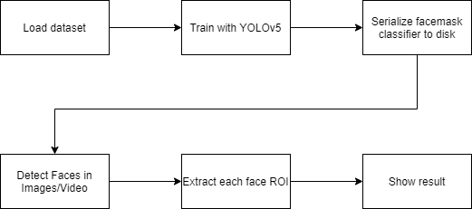
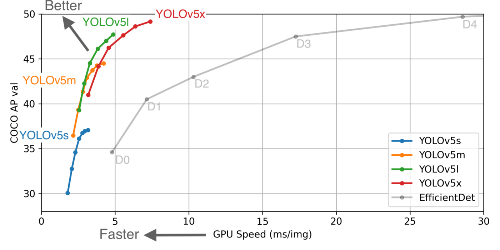
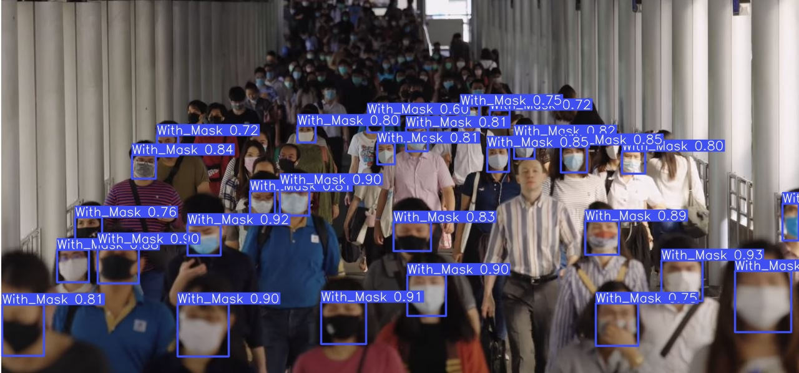

  <h1 align="center">FACEMASK DETECTION USING YOLOv5</h1>

  
Table of Contents

  <ol>
    <li>
      <a href="#about-the-project">About The Project</a>
      <ul>
        <li><a href="#built-with">Built With</a></li>
      </ul>
    </li>
    <li><a href="#pre-processing-data">Pre-Processing Data</a></li>
    <li><a href="#training-with-yolov5">Training with YOLOv5</a></li>
    <li><a href="#tests">Tests</a></li>
    <li><a href="#resources">Resources</a></li>
    <li><a href="#license">License</a></li>
  </ol>

## About The Project

COVID-19 is a major problem worldwide. So I wanted to do something to make sure that we are protected from the virus and as they say 'Prevention is the best cure' which led me to make this face mask detector. 

Initially I wanted to use FasterRCNN to detect the mask but then I stumbled upon this thing called YOLOv5 which is not only light weight but much faster than FasterRCNN and can be used in embedded systems with any custom dataset for detecting a lot of stuffs.

### Built With

This section lists any major technologies that I built this project using. Here are a few examples.
* Python
* YOLOv5
* Matplotlib
* Numpy
* Sklearn

## Pre-Processing Data

I have used a [publicly available dataset](https://www.kaggle.com/andrewmvd/face-mask-detection) from Kaggle. The dataset contains 853 images and their corresponding annotation files, indicating whether a person is wearing a mask correctly, incorrectly or not wearing it. 

  

In order to train the model, a necessary step will be to change the format of the .xml annotation files so that they conform with the darknet format. I have done that with the help of [xml.dom.minidom](https://docs.python.org/3/library/xml.dom.minidom.html) library.

After that we split the data into train, valid and test. And now it's time to train.

## Training with YOLOv5

“YOLO”, refering to “You Only Look Once”, is a family of object detection models introduced by Joseph Redmon with a 2016 publication “You Only Look Once: Unified, Real-Time Object Detection”. Since then, several newer versions have been released, of which, the first three were released by Joseph Redmon. On June 29, Glenn Jocher released the latest version YOLOv5, claiming significant improvements with respect to its predecessor. The most interesting improvement, is its “blazingly fast inference”. As posted [in this article](https://blog.roboflow.com/yolov5-is-here/) by Roboflow, running in a Tesla P100, YOLOv5 achieves inference times of up to 0.007 seconds per image, meaning 140 FPS!

  

I have trained the model using GPU with 300 epochs and a batch size of 20 which took somewhere around 3 hours.

_For more information, please refer to the [Documentation](https://github.com/rkuo2000/yolov5)_

## Tests

Using detect.py we now can detect facemasks on the images! I have used a confidence threshold of 60%.

  

## Resources

* https://github.com/rkuo2000/yolov5
* https://colab.research.google.com/drive/1gDZ2xcTOgR39tGGs-EZ6i3RTs16wmzZQ#scrollTo=7KN5ghjE6ZWh
* https://docs.python.org/3/library/xml.dom.minidom.html
* https://colab.research.google.com/github/ultralytics/yolov5/blob/master/tutorial.ipynb
* https://towardsdatascience.com/face-mask-detection-using-yolov5-3734ca0d60d8
* https://www.pyimagesearch.com/2020/05/04/covid-19-face-mask-detector-with-opencv-keras-tensorflow-and-deep-learning/
* https://www.kaggle.com/andrewmvd/face-mask-detection

## LICENSE

Distributed under the MIT License. See `LICENSE` for more information.

